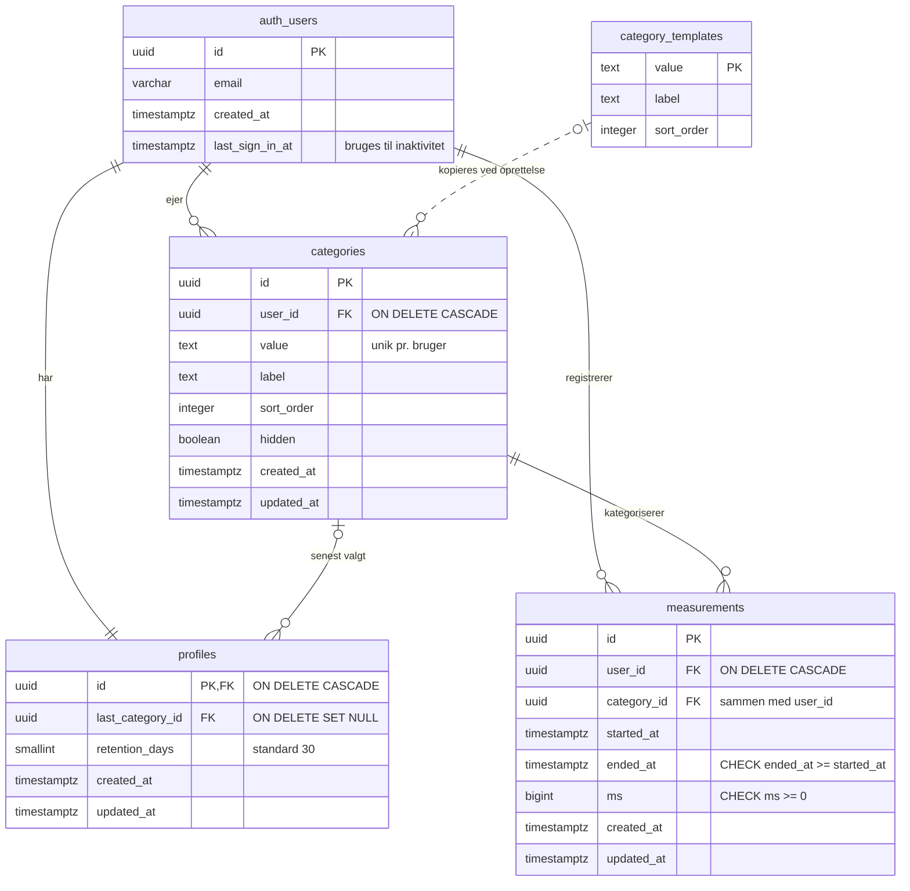

# ER-diagram

Indsæt koden i mermaid.live for at se diagrammet.

```mermaid
erDiagram
  auth_users ||--|| profiles : "har"
  auth_users ||--o{ categories : "ejer"
  auth_users ||--o{ measurements : "registrerer"
  categories ||--o{ measurements : "kategoriserer"
  categories |o--o{ profiles : "senest valgt"
  category_templates |o..o{ categories : "kopieres ved oprettelse"

  auth_users {
    uuid id PK
    varchar email
    timestamptz created_at
    timestamptz last_sign_in_at "bruges til inaktivitet"
  }

  profiles {
    uuid id PK, FK "ON DELETE CASCADE"
    uuid last_category_id FK "ON DELETE SET NULL"
    smallint retention_days "standard 30"
    timestamptz created_at
    timestamptz updated_at
  }

  categories {
    uuid id PK
    uuid user_id FK "ON DELETE CASCADE"
    text value "unik pr. bruger"
    text label
    integer sort_order
    boolean hidden
    timestamptz created_at
    timestamptz updated_at
  }

  measurements {
    uuid id PK
    uuid user_id FK "ON DELETE CASCADE"
    uuid category_id FK "sammen med user_id"
    timestamptz started_at
    timestamptz ended_at "CHECK ended_at >= started_at"
    bigint ms "CHECK ms >= 0"
    timestamptz created_at
    timestamptz updated_at
  }

  category_templates {
    text value PK
    text label
    integer sort_order
  }
```
